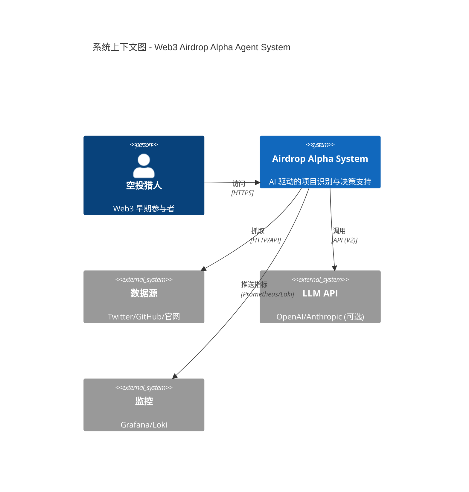
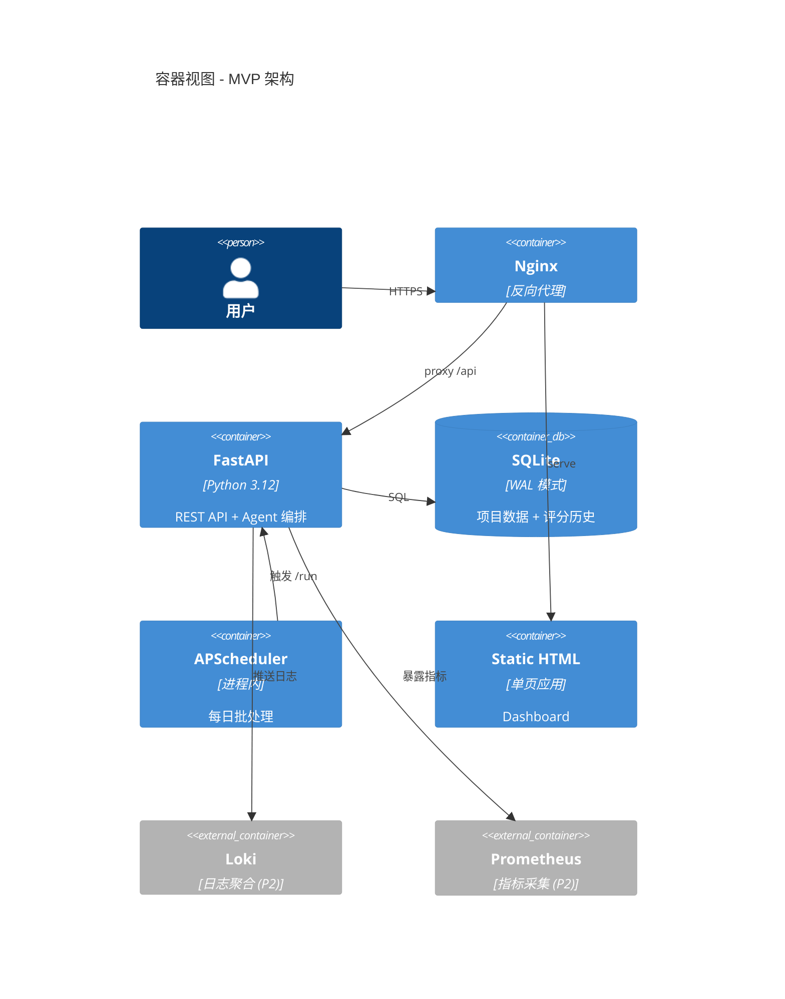
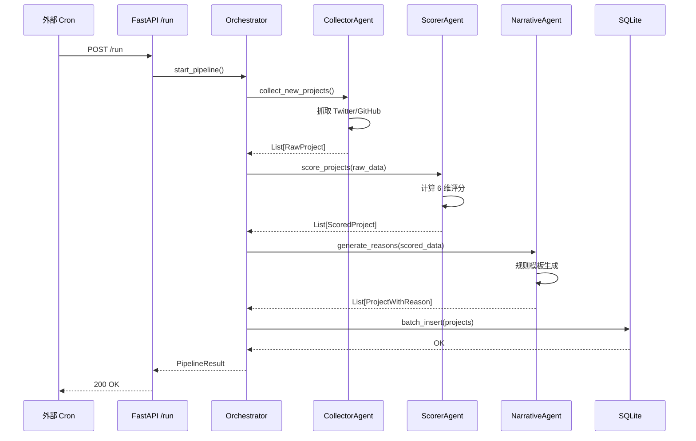
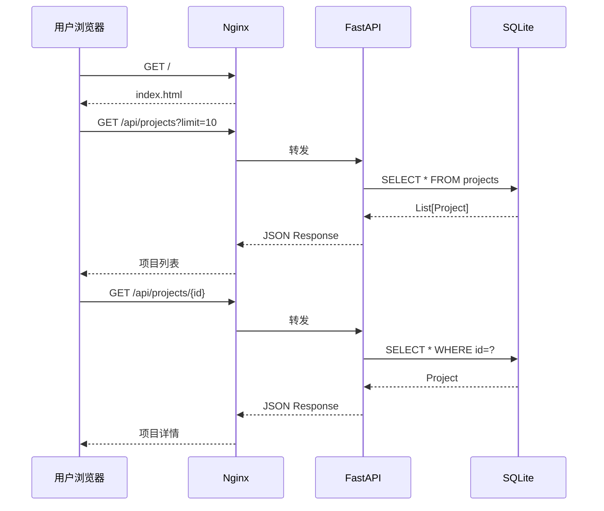

# 02 系统架构 (System Architecture)

> 引用：[`ENGINEERING_ROADMAP.md`](ENGINEERING_ROADMAP.md) + ADR-002/004/005/007  
> 阶段：MVP → V2  
> 更新：2026-07-08

---

## 1. 架构概览

### 1.1 系统上下文图



### 1.2 核心设计原则

| 原则 | 说明 | 体现 |
|-----|------|------|
| **Agent First** | 每个功能由独立 Agent 完成 | 15 个 Agent 定义 |
| **数据驱动** | 决策基于结构化评分 | 6 维评分决策引擎 |
| **渐进式复杂度** | MVP 简单，V2 扩展 | SQLite → PostgreSQL |
| **可观测优先** | 内建日志 + 指标 | structlog + Prometheus |
| **安全默认** | 默认关闭外部依赖 | ADR-001: LLM 默认关闭 |

---

## 2. 容器视图 (C4 - Container Level)



### V2 架构演进

| 组件 | MVP | V2 |
|-----|-----|-----|
| **前端** | 单页 HTML | Next.js + React |
| **数据库** | SQLite (WAL) | PostgreSQL |
| **调度** | APScheduler 进程内 | 外部 cron + POST /run |
| **LLM** | 关闭（规则生成） | 可选插件（真实调用） |
| **用户系统** | 无 | JWT + 多租户隔离 |
| **缓存** | 无 | Redis (竞争度缓存) |

---

## 3. 组件视图 (Component Level)

### 3.1 后端应用分层

```
backend/app/
├── main.py              # FastAPI 应用入口
├── config.py            # pydantic-settings 配置
├── db.py                # 数据库访问层
├── models.py            # Pydantic 数据模型
├── api/                 # API 路由
│   ├── health.py        # 健康检查
│   ├── projects.py      # 项目 CRUD
│   └── run.py           # 触发批处理
├── agents/              # Agent 实现
│   ├── orchestrator.py  # 编排器（ADR-002）
│   ├── collector.py     # 数据采集 Agent
│   ├── scorer.py        # 评分 Agent
│   └── narrative.py     # Reason 生成 Agent
├── services/            # 业务逻辑
│   ├── scoring.py       # 评分决策引擎
│   └── cache.py         # 竞争度缓存 (V2)
└── utils/               # 工具类
    ├── logger.py        # structlog 配置
    └── metrics.py       # Prometheus 指标
```

### 3.2 核心组件职责

| 组件 | 职责 | 依赖 |
|-----|------|------|
| **Orchestrator** | 编排 Agent 执行流 | ADR-002 |
| **CollectorAgent** | 从数据源抓取原始数据 | 外部 API |
| **ScorerAgent** | 计算 6 维评分 + 总分 | 评分决策引擎 |
| **NarrativeAgent** | 生成 reason 文本 | 规则模板 / LLM (V2) |
| **ScoringService** | 封装评分逻辑 | `DATA_SCORING_DICT.md` |
| **CacheService** | 竞争度缓存 | ADR-010 (V2) |

---

## 4. 数据流图

### 4.1 每日批处理流程



### 4.2 用户查询流程



---

## 5. 部署架构

### 5.1 MVP 单实例部署

```
┌─────────────────────────────────────┐
│         Docker Host (单机)           │
│                                     │
│  ┌──────────────────────────────┐  │
│  │   Nginx (80/443)             │  │
│  │   ├─ / → frontend/           │  │
│  │   └─ /api → backend:8000     │  │
│  └──────────────────────────────┘  │
│                                     │
│  ┌──────────────────────────────┐  │
│  │   FastAPI (8000)             │  │
│  │   ├─ API 路由                │  │
│  │   ├─ Agent 编排              │  │
│  │   └─ APScheduler             │  │
│  └──────────────────────────────┘  │
│                                     │
│  ┌──────────────────────────────┐  │
│  │   SQLite (文件)              │  │
│  │   /data/airdrop.db           │  │
│  └──────────────────────────────┘  │
│                                     │
│  ┌─────────────────────────────┐   │
│  │  Loki + Promtail (可选)     │   │
│  │  Prometheus + Grafana       │   │
│  └─────────────────────────────┘   │
└─────────────────────────────────────┘
```

### 5.2 V2 生产部署（规划）

```
┌────────────────────────────────────────────────┐
│              Load Balancer (Nginx)              │
└────────────────┬───────────────────────────────┘
                 │
     ┌───────────┴───────────┐
     │                       │
┌────▼────┐            ┌────▼────┐
│ Backend │            │ Backend │
│ Pod 1   │            │ Pod 2   │
└────┬────┘            └────┬────┘
     │                       │
     └───────────┬───────────┘
                 │
         ┌───────▼────────┐
         │  PostgreSQL    │
         │  (Primary)     │
         └────────────────┘
         
         ┌───────▼────────┐
         │  Redis         │
         │  (Cache)       │
         └────────────────┘
```

---

## 6. 技术决策（ADR 引用）

| 决策 | ADR | 影响组件 |
|-----|-----|---------|
| **自研 Orchestrator** | ADR-002 | `agents/orchestrator.py` |
| **SQLite → PostgreSQL** | ADR-004 | `db.py`, `database/` |
| **APScheduler 进程内** | ADR-005 | `main.py` 启动逻辑 |
| **多项目并发模型** | ADR-007 | Orchestrator 并发控制 |
| **用户系统与隔离** | ADR-008 | V2 `auth/`, `models.py` |
| **竞争度缓存** | ADR-010 | V2 `services/cache.py` |

---

## 7. 关键质量属性

### 7.1 性能

- **MVP 目标**：p95 < 500ms (API), < 10min (批处理)
- **V2 目标**：p95 < 200ms (API), 支持 100 项目/天

### 7.2 可扩展性

- **水平扩展**：V2 支持多 Backend 实例
- **存储扩展**：PostgreSQL 支持 10M+ 项目记录

### 7.3 可靠性

- **MVP**：允许计划停机，数据持久化
- **V2**：99.5% 可用性，自动故障转移

### 7.4 安全性

详见 [`SECURITY.md`](SECURITY.md)
- API 无鉴权（MVP），V2 加 JWT
- 密钥管理：环境变量 + `.env`
- 依赖扫描：`security.yml` 自动化

---

## 8. 监控 & 观测

详见 [`OBSERVABILITY.md`](OBSERVABILITY.md)

### 8.1 日志

- **格式**：JSON (structlog)
- **级别**：INFO (生产), DEBUG (开发)
- **聚合**：Loki (P2)

### 8.2 指标

| 指标 | 说明 |
|-----|------|
| `api_requests_total` | API 请求总数 |
| `api_request_duration_seconds` | API 响应时间 |
| `pipeline_runs_total` | 批处理执行次数 |
| `pipeline_duration_seconds` | 批处理耗时 |
| `projects_discovered_total` | 发现项目总数 |

### 8.3 告警规则

- API p95 > 1s 持续 5 分钟
- 批处理失败连续 2 次
- 数据库磁盘使用 > 80%

---

## 9. 相关文档

- 技术路线图：[`ENGINEERING_ROADMAP.md`](ENGINEERING_ROADMAP.md)
- 数据库设计：[`DATABASE_DDL.md`](DATABASE_DDL.md)
- API 契约：[`API_SPEC.md`](API_SPEC.md)
- 部署指南：[`DEPLOYMENT.md`](DEPLOYMENT.md)
- 安全规范：[`SECURITY.md`](SECURITY.md)
- 监控文档：[`OBSERVABILITY.md`](OBSERVABILITY.md)

---

_文档版本：v1.0 · 2026-07-08_
