# AI-Driven Development Workflow

> 本文件定义 Web3 Airdrop Alpha Agent System 的 AI 协作开发全流程。
> 从需求到发布，每步明确定义输入、输出、负责人（Agent）和验收标准。

---

## 1. 总流程图

```mermaid
graph LR
    A[需求] --> B[架构]
    B --> C[ADR]
    C --> D[文档]
    D --> E[Knowledge]
    E --> F[Skills]
    F --> G[Agent 分工]
    G --> H[Prompt]
    H --> I[Coding]
    I --> J[Review]
    J --> K[Test]
    K --> L[Evaluation]
    L --> M[Merge]
    M --> N[Release]

    style A fill:#e1f5fe
    style N fill:#c8e6c9
```

---

## 2. 各步骤详述

### Step 1: 需求 → 架构 (Requirement → Architecture)

| 维度 | 说明 |
| --- | --- |
| **输入** | 用户需求描述、Issue、Feature Request |
| **负责 Agent** | Planner → Architect |
| **输出** | 架构设计文档、技术栈选型、模块划分 |
| **验收标准** | 设计覆盖所有需求点；无歧义；可被后续 Agent 理解执行 |
| **工具** | `planner/`, `architect/` |
| **参考** | `docs/ENGINEERING_ROADMAP.md` |

### Step 2: ADR (Architecture Decision Record)

| 维度 | 说明 |
| --- | --- |
| **输入** | 架构决策点（技术选型、方案对比） |
| **负责 Agent** | Architect |
| **输出** | ADR 文件（`docs/adr/ADR-xxx.md`） |
| **验收标准** | 含背景、决策、理由、后果；ADR 模板规范 |
| **模板** | `docs/adr/README.md` 中的 ADR 模板 |
| **引用** | 在 Roadmap §18 索引中加入新 ADR 条目 |

### Step 3: 文档 (Documentation)

| 维度 | 说明 |
| --- | --- |
| **输入** | 架构设计、ADR |
| **负责 Agent** | Documentation |
| **输出** | `docs/` 下对应规范文档 |
| **验收标准** | 格式符合 GFM；交叉引用完整；版本号标注 |
| **参考** | `CONVENTIONS.md §15` 文档规范 |

### Step 4: Knowledge (知识库更新)

| 维度 | 说明 |
| --- | --- |
| **输入** | 新功能/新模块的设计与实现 |
| **负责 Agent** | Knowledge |
| **输出** | `knowledge/` 下对应知识更新 |
| **验收标准** | 知识更新与文档一致；交叉引用正确 |
| **引用格式** | `[KN:category:key]` |

### Step 5: Skills (Skills 创建/更新)

| 维度 | 说明 |
| --- | --- |
| **输入** | 需要可复用的开发模式 |
| **负责 Agent** | Architecture + Backend |
| **输出** | `skills/` 下 Skill 文件 |
| **验收标准** | Skill 可被其他 Agent 引用执行 |
| **模板** | `skills/README.md` 中的 Skill 模板 |

### Step 6: Agent 分工 (Agent Assignment)

| 维度 | 说明 |
| --- | --- |
| **输入** | 任务分解（Task Breakdown） |
| **负责 Agent** | Planner |
| **输出** | Agent 任务分配表 |
| **验收标准** | 每个子任务有明确负责 Agent；无职责重叠 |
| **参考** | `agents/README.md` Agent 角色定义 |

### Step 7: Prompt (Prompt 编写/更新)

| 维度 | 说明 |
| --- | --- |
| **输入** | Agent 需求、输出 schema |
| **负责 Agent** | Prompt |
| **输出** | `prompts/` 下 Prompt 模板 |
| **验收标准** | 结构化输出 JSON schema；边界值测试通过 |
| **版本** | 每次变更递增 `prompt_version` |

### Step 8: Coding (编码实现)

| 维度 | 说明 |
| --- | --- |
| **输入** | 架构设计 + Prompt + Skill |
| **负责 Agent** | Backend / Frontend / Database |
| **输出** | 实现代码 + 单元测试 |
| **验收标准** | 遵循 CONVENTIONS.md；测试通过；覆盖率达标 |
| **约束** | 一个 PR 只做一件事；变更前先更新测试 |

### Step 9: Review (代码审查)

| 维度 | 说明 |
| --- | --- |
| **输入** | PR 代码 |
| **负责 Agent** | Reviewer + Security + Performance |
| **输出** | Review Report |
| **验收标准** | 16 项自查清单全部通过（CONVENTIONS.md §16） |
| **阻断条件** | 安全漏洞 / 覆盖率下降 >3% / breaking change 未标记 |

### Step 10: Test (测试验证)

| 维度 | 说明 |
| --- | --- |
| **输入** | 实现代码 |
| **负责 Agent** | Tester |
| **输出** | 测试报告 |
| **验收标准** | 单元测试全绿；契约测试全绿；golden 回归通过 |
| **覆盖率** | 行 ≥ 80%，关键模块 ≥ 90% |

### Step 11: Evaluation (评估)

| 维度 | 说明 |
| --- | --- |
| **输入** | 测试报告、用户反馈 |
| **负责 Agent** | Evaluation |
| **输出** | 质量评估报告 |
| **验收标准** | LLM 评估（V2）；评分漂移检查；数据质量度量 |

### Step 12: Merge → Release (合并 → 发布)

| 维度 | 说明 |
| --- | --- |
| **输入** | 已批准的 PR |
| **负责 Agent** | Release |
| **输出** | 发布检查清单 + 上线确认 |
| **验收标准** | CI 全绿；部署后冒烟通过；changelog 更新 |
| **工具** | `.github/workflows/release.yml` |

---

## 3. 各步骤负责人矩阵

| 步骤 | 主要 Agent | 辅助 Agent | 审批人 |
| --- | --- | --- | --- |
| 需求→架构 | Architect | Researcher | Tech Lead |
| ADR | Architect | — | Tech Lead |
| 文档 | Documentation | — | Tech Lead |
| Knowledge | Knowledge | — | 任意 |
| Skills | Backend/Architect | — | Tech Lead |
| Agent 分工 | Planner | — | — |
| Prompt | Prompt | — | Tech Lead |
| Coding | Backend/Frontend/DB | — | Self |
| Review | Reviewer | Security, Performance | Reviewer |
| Test | Tester | — | — |
| Evaluation | Evaluation | — | Tech Lead |
| Merge→Release | Release | DevOps | Tech Lead |

---

## 4. 异常处理

| 异常情况 | 处理流程 |
| --- | --- |
| Review 不通过 | Reviewer 列出问题 → 返回 Coding 步骤修复 → 重新 Review |
| 测试失败 | Tester 定位失败原因 → 返回 Coding 步骤修复 |
| 架构问题 | Architect 重新设计 → 更新 ADR → 通知下游受影响的 Agent |
| 需求变更 | Planner 重新分解任务 → 更新受影响的步骤 |
| 安全漏洞 | Security 记录 → P0 紧急修复 → 事后 postmortem |

---

## 5. AI 协作原则

1. **AI First**：默认优先使用 AI Agent 完成任务，人工仅做审批和关键决策。
2. ** Agent First**：新功能开发前先确认是否有对应 Agent/Skill 可用。
3. **文档驱动**：编码前必须有文档/ADR/Skill，无文档不编码。
4. **渐进式验证**：每步完成后自动验证，不等到最终集成才发现问题。
5. **知识沉淀**：每完成一个功能，必须同步更新 Knowledge Base。

---

_文档版本：v1.0 · 2026-07-08_
