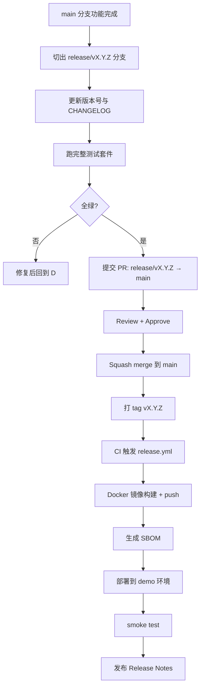
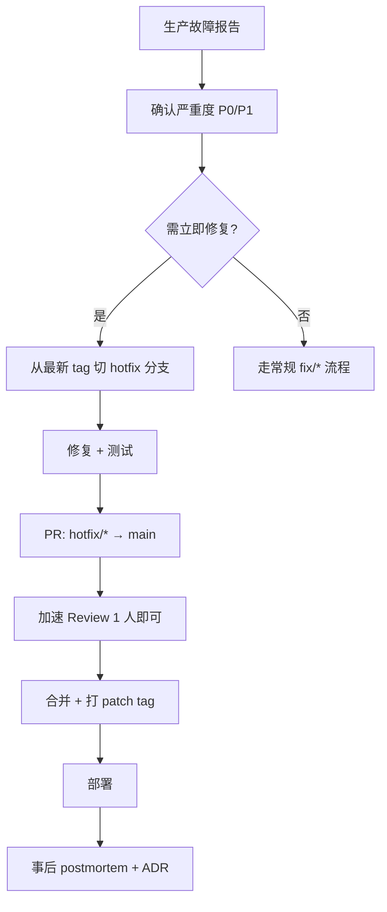

# Git 工作流规范

> 配套文档：`CONVENTIONS.md §11`（分支与 commit）、`.github/workflows/release.yml`、`CHANGELOG.md`
>
> 本文档覆盖完整的 Git 工作流：分支策略、提交规范、版本策略、发布流程、Tag 策略、Code Review、Hotfix、Rollback。

---

## 1. 分支策略

> 详细分支表见 `CONVENTIONS.md §11.1`，此处补充流程约束。

### 1.1 分支模型（GitHub Flow + Release Branch 混合）

```
main (生产就绪)
 │
 ├─ feat/scorer-competition-cache ──→ PR ──→ main
 ├─ fix/llm-timeout-handling ───────→ PR ──→ main
 ├─ docs/api-spec-update ───────────→ PR ──→ main
 │
 └─ release/v0.2.0 ──→ tag v0.2.0 ──→ main (merge back)
```

### 1.2 分支命名规范

| 前缀 | 用途 | 生命周期 | 示例 |
| --- | --- | --- | --- |
| `feat/*` | 新功能 | 合并后删除 | `feat/scorer-competition-cache` |
| `fix/*` | Bug 修复 | 合并后删除 | `fix/llm-timeout-handling` |
| `docs/*` | 文档变更 | 合并后删除 | `docs/api-spec-update` |
| `perf/*` | 性能优化 | 合并后删除 | `perf/db-index-projects` |
| `refactor/*` | 重构 | 合并后删除 | `refactor/scorer-extract-strategy` |
| `test/*` | 测试补充 | 合并后删除 | `test/golden-add-10-cases` |
| `chore/*` | 构建/CI/杂项 | 合并后删除 | `chore/update-deps` |
| `release/v*` | 发布分支 | 发布后保留 30 天 | `release/v0.2.0` |
| `hotfix/*` | 紧急修复 | 合并后删除 | `hotfix/v0.1.1-llm-crash` |

### 1.3 分支约束

- `main` 分支保护：禁止直接 push，仅通过 PR + 至少 1 个 review + CI 全绿。
- 分支从 `main` 最新 commit 切出，PR 前必须 rebase 到最新 `main`。
- 单个分支生命周期 ≤ 7 天（避免长期分叉）；超期需拆分或合并。
- 分支命名全小写 + 连字符，禁止下划线、空格、中文。

---

## 2. Commit 规范

> 详细 commit message 格式见 `CONVENTIONS.md §11.2`。

### 2.1 Conventional Commits

```
<type>(<scope>): <简短描述>

<详细说明（可选，每行 ≤ 72 字符）>

[Closes #<issue>]
[Ref: ADR-0xx]
```

### 2.2 Type 清单

| type | 含义 | 触发 release | 示例 |
| --- | --- | --- | --- |
| `feat` | 新功能 | minor bump | `feat(scorer): add competition cache` |
| `fix` | Bug 修复 | patch bump | `fix(llm): handle timeout gracefully` |
| `docs` | 文档 | 不触发 | `docs(api): update projects endpoint` |
| `refactor` | 重构（无行为变更） | 不触发 | `refactor(scorer): extract strategy` |
| `test` | 测试 | 不触发 | `test(golden): add 10 cases` |
| `chore` | CI/构建/杂项 | 不触发 | `chore(deps): bump fastapi to 0.111` |
| `perf` | 性能优化 | patch bump | `perf(db): add index on projects.sector` |
| `build` | 构建系统变更 | 不触发 | `build(docker): use multi-stage` |
| `ci` | CI 配置变更 | 不触发 | `ci: add security workflow` |
| `revert` | 回滚 | 视情况 | `revert: feat(scorer) competition cache` |

### 2.3 Scope 清单

| scope | 范围 |
| --- | --- |
| `scorer` | Scorer Agent / 评分算法 |
| `narrative` | Narrative Agent |
| `team` | Team Agent |
| `risk` | Risk Agent |
| `tokenomics` | Tokenomics Agent |
| `collector` | Collector Agent |
| `llm` | LLM 客户端 / 集成 |
| `db` | 数据库 / schema / 迁移 |
| `api` | FastAPI 端点 |
| `config` | 配置管理 |
| `scheduler` | 调度器 |
| `prompts` | Prompt 模板 |
| `agents` | Agent 框架 |
| `docker` | Docker 配置 |
| `deps` | 依赖 |

### 2.4 Commit 粒度

- 一个 commit 只做一件事（原子性）。
- 单个 PR 可含多个 commit，但 squash merge 时取 PR 标题作为 commit message。
- 禁止 `git push --force` 到 `main`；feature 分支 force push 需在 PR 描述中说明原因。
- 禁止 commit 含 `console.log` / `print()` / 调试断点 / `.env` 文件。

---

## 3. 版本策略（Semantic Versioning）

### 3.1 版本号格式

```
MAJOR.MINOR.PATCH
  │     │     │
  │     │     └─ 向后兼容的 Bug 修复 / 小改进
  │     └─────── 向后兼容的新功能
  └───────────── 不兼容的 API / 数据模型变更
```

### 3.2 版本号决策规则

| 变更类型 | bump 级别 | 示例 |
| --- | --- | --- |
| 新增 Agent / 新 API 端点 / 新 Feature Flag | minor | 0.1.0 → 0.2.0 |
| Bug 修复 / 性能优化 / 依赖升级 | patch | 0.1.0 → 0.1.1 |
| Pydantic 模型字段删除 / API 响应字段变更 / DB schema 不兼容 | major | 0.1.0 → 1.0.0 |
| 文档 / 测试 / 重构 | 不 bump | — |

### 3.3 Pre-release 版本

| 标识 | 用途 | 示例 |
| --- | --- | --- |
| `-alpha.N` | 内部测试 | `0.2.0-alpha.1` |
| `-beta.N` | 外部测试 / staging | `0.2.0-beta.1` |
| `-rc.N` | 发布候选 | `0.2.0-rc.1` |

### 3.4 版本号位置

| 位置 | 文件 | 更新时机 |
| --- | --- | --- |
| 代码版本 | `pyproject.toml` `version` | release PR |
| 运行时版本 | `backend/app/config.py` `app_version` | 同步 pyproject |
| API 响应头 | `X-API-Version: v0.2.0` | 自动注入 |
| Docker 镜像 tag | `ghcr.io/.../web3-airdrop-alpha:v0.2.0` | CI 自动 |
| CHANGELOG | `CHANGELOG.md` | release PR |

### 3.5 0.x.y 阶段约定

当前处于 `0.x.y`（Alpha 阶段），以下规则放宽：
- minor bump 允许不兼容变更（但需在 CHANGELOG 显著标注 BREAKING）。
- 不保证数据迁移路径（DB schema 变更可直接重建）。
- `1.0.0` 发布条件：MVP 全功能 + 至少 1 轮外部用户试用 + 文档完整 + 安全审计通过。

---

## 4. Release 流程

### 4.1 Release 流程图



### 4.2 Release 步骤清单

1. **切出 release 分支**
   ```bash
   git checkout main
   git pull origin main
   git checkout -b release/v0.2.0
   ```

2. **更新版本号**
   - `pyproject.toml`: `version = "0.2.0"`
   - `backend/app/config.py`: `app_version = "0.2.0"`

3. **更新 CHANGELOG**
   - 将 `[Unreleased]` 段落重命名为 `[0.2.0] - 2026-07-08`
   - 新建空的 `[Unreleased]` 段落

4. **跑完整测试**
   ```bash
   make test-all  # unit + contract + golden + api + e2e
   ```

5. **提交 PR**
   - 标题：`chore(release): v0.2.0`
   - body 引用本 RELEASE 清单

6. **合并后打 tag**
   ```bash
   git checkout main
   git pull origin main
   git tag -a v0.2.0 -m "Release v0.2.0"
   git push origin v0.2.0
   ```

7. **CI 自动触发**（`.github/workflows/release.yml`）
   - Docker 镜像构建 + push 到 ghcr.io
   - SBOM 生成
   - 部署到 demo（如启用）

8. **发布 GitHub Release Notes**
   - 从 CHANGELOG 复制对应版本段落
   - 附 SBOM artifact 链接

### 4.3 Release 节奏

| 类型 | 频率 | 触发条件 |
| --- | --- | --- |
| **Patch** | 按需 | Bug 修复累计 ≥ 3 个或有紧急修复 |
| **Minor** | 每 2-4 周 | Sprint 结束 + 新功能就绪 |
| **Major** | 按里程碑 | 1.0.0 / 2.0.0 等关键节点 |

---

## 5. Tag 策略

### 5.1 Tag 命名

| 格式 | 用途 | 示例 |
| --- | --- | --- |
| `vX.Y.Z` | 正式发布 | `v0.2.0` |
| `vX.Y.Z-rc.N` | 发布候选 | `v0.2.0-rc.1` |
| `vX.Y.Z-beta.N` | Beta 测试 | `v0.2.0-beta.1` |

### 5.2 Tag 规范

- 使用 **annotated tag**（`git tag -a`），含 tag message。
- Tag 不可变：发布后不得删除或移动（除非 `revert` 后以 `vX.Y.Z.post1` 重新发布）。
- Tag 与 `main` 的 commit 一一对应，1:1 映射。
- Tag 推送后自动触发 `release.yml`。

### 5.3 Tag 与 Docker 镜像映射

| Git Tag | Docker Tag | 说明 |
| --- | --- | --- |
| `v0.2.0` | `v0.2.0`, `0.2`, `latest` | 正式版 |
| `v0.2.0-rc.1` | `v0.2.0-rc.1` | 候选版，不打 `latest` |
| `main` commit | `sha-<short>` | 每次合并自动构建（dev 用） |

---

## 6. Code Review 流程

### 6.1 PR 提交前自查

> 完整清单见 `.github/PULL_REQUEST_TEMPLATE.md`。

核心项：
- [ ] 本地 `pytest -q --cov` 全绿，覆盖率 ≥ 80%
- [ ] `ruff check .` + `ruff format --check .` 通过
- [ ] 无 `print()` / 调试断点残留
- [ ] Pydantic 模型变更同步更新契约测试
- [ ] API 变更同步更新 `API_SPEC.md`
- [ ] 环境变量变更同步更新 `.env.example`

### 6.2 Review 角色矩阵

| 变更类型 | 必须 Reviewer | 可选 Reviewer |
| --- | --- | --- |
| 评分算法 / 权重变更 | Architect + Backend | Security |
| DB schema 变更 | Backend + Database | Architect |
| API 端点新增/变更 | Backend | Frontend |
| Prompt 模板变更 | Prompt Engineer | Architect |
| 安全相关 | Security Reviewer | Architect |
| Agent 新增/职责变更 | Architect | Backend |
| ADR 新增 | Architect | 任意角色 |
| 文档 only | 任意角色 | — |

### 6.3 Review 检查点

Reviewer 重点关注：

1. **架构一致性**：是否符合 `ENGINEERING_ROADMAP.md` 与 ADR 决策？
2. **测试充分性**：关键路径是否有测试？边界条件是否覆盖？
3. **安全**：是否有密钥泄漏？输入校验是否充分？AI 特有风险（`SECURITY.md §10`）是否考虑？
4. **性能**：是否有 N+1 查询？是否引入阻塞调用？
5. **可观测性**：日志事件名是否规范？关键操作是否留痕？
6. **文档同步**：相关文档是否同步更新？

### 6.4 Review 时效

| PR 优先级 | 响应时效 | 示例 |
| --- | --- | --- |
| P0（阻塞生产） | 2h 内 | 紧急修复 |
| P1（阻塞 Sprint） | 1 工作日内 | 常规功能 |
| P2（非阻塞） | 2 工作日内 | 文档 / 优化 |

---

## 7. Hotfix 流程

### 7.1 Hotfix 触发条件

- 生产环境 P0/P1 故障（`SECURITY.md §9.1`）
- 评分系统性错误
- 安全漏洞

### 7.2 Hotfix 流程图



### 7.3 Hotfix 步骤

1. **切出 hotfix 分支**
   ```bash
   git checkout v0.2.0  # 从出问题的 tag 切
   git checkout -b hotfix/v0.2.1-llm-crash
   ```

2. **修复 + 测试**
   - 最小化改动，只修复目标问题，不夹带其他变更。
   - 必须有对应的回归测试。

3. **提交 PR**
   - 标题：`fix(llm): handle crash on empty response (hotfix v0.2.1)`
   - body 标注 `HOTFIX` + 故障描述 + 影响。

4. **加速 Review**
   - P0：1 人 review 即可合并（通常 Architect 或 Backend）。
   - Review 时效：30 分钟内。

5. **合并 + 打 patch tag**
   ```bash
   git tag -a v0.2.1 -m "Hotfix: LLM crash on empty response"
   git push origin v0.2.1
   ```

6. **部署 + 验证**
   - CI 自动构建 `v0.2.1` 镜像。
   - 部署后验证故障已修复。

7. **事后**
   - 24h 内产出 postmortem（`OPERATIONS.md` 模板）。
   - 如涉及架构，补 ADR。

---

## 8. Rollback 流程

### 8.1 Rollback 触发条件

- 新版本发布后出现 P0 故障，无法快速 hotfix。
- 发布后核心指标（评分一致性、API 错误率）显著退化。
- 回滚决策由 Architect 或 Release Manager 做出。

### 8.2 Rollback 步骤

1. **确认回滚目标版本**
   - 通常回滚到上一个稳定 tag（如 `v0.2.0` 出问题回滚到 `v0.1.2`）。
   - 确认目标版本的 DB schema 与当前 DB 兼容（不兼容则需数据回滚）。

2. **回滚 Docker 镜像**
   ```bash
   # 生产服务器
   docker compose -f docker-compose.prod.yml down
   docker pull ghcr.io/.../web3-airdrop-alpha:v0.1.2
   # 修改 docker-compose.prod.yml image tag 为 v0.1.2
   docker compose -f docker-compose.prod.yml up -d
   sleep 5
   curl -f http://localhost:8000/health
   ```

3. **回滚数据库（如需）**
   - 仅当 schema 不兼容时。
   - 使用最近备份恢复（`OPERATIONS.md §6.2`）。
   - 数据丢失需在 postmortem 中评估。

4. **验证**
   - 健康检查通过。
   - 核心 API 可访问。
   - 评分 pipeline 可触发。
   - 监控指标恢复正常。

5. **通知 + 事后**
   - 通知相关用户。
   - 24h 内 postmortem，明确根因 + 防止再发的措施。

### 8.3 Rollback 决策矩阵

| 场景 | 动作 | 数据影响 |
| --- | --- | --- |
| 应用代码 Bug | 回滚镜像 | 无 |
| DB schema 不兼容变更 | 回滚镜像 + 恢复备份 | 可能丢失发布后数据 |
| 配置错误 | 改 env 重启，不回滚 | 无 |
| 外部依赖故障 | 不回滚，启用降级 | 无 |

### 8.4 Rollback 限制

- **不可回滚的情况**：
  - DB 已执行不可逆迁移（如 `DROP COLUMN`）。
  - 已有用户基于新版本数据产生交互（feedback 已提交）。
  - 此时只能 hotfix，不能 rollback。

- **预防**：
  - 不兼容 DB 变更分两次发布（先加新字段 → 迁移数据 → 再删旧字段）。
  - 发布前必须备份 DB（`OPERATIONS.md §6`）。

---

## 9. CHANGELOG 管理

### 9.1 格式（Keep a Changelog）

```markdown
# Changelog

## [Unreleased]

## [0.2.0] - 2026-07-08

### Added
- 竞争度子分缓存（ADR-010）
- `/api/v1/projects/{id}/score-history` 端点

### Changed
- LLM 超时从 30s 降至 15s

### Fixed
- 修复 Narrative Agent 在 sector 为空时崩溃的问题

### Security
- 修复 prompt injection 防御遗漏（SECURITY.md §10.1）

### BREAKING
- `GET /api/v1/projects` 响应字段 `score` 改为 `total_score`（原字段废弃，保留 1 个版本兼容期）
```

### 9.2 变更类型

| 类型 | 含义 |
| --- | --- |
| `Added` | 新功能 |
| `Changed` | 现有功能变更 |
| `Deprecated` | 即将移除 |
| `Removed` | 已移除 |
| `Fixed` | Bug 修复 |
| `Security` | 安全相关修复 |
| `BREAKING` | 不兼容变更（置顶） |

### 9.3 更新时机

- 每次合并 PR 时，由 PR 作者在 `[Unreleased]` 段落追加对应条目。
- Release 时将 `[Unreleased]` 改为版本号 + 日期，新建空 `[Unreleased]`。

---

_文档版本：v1.0 · 2026-07-08_
