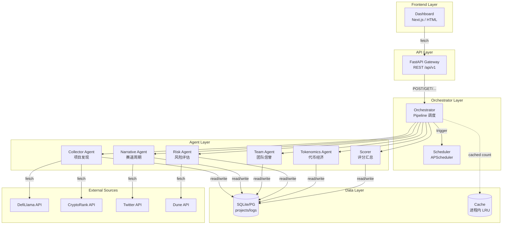
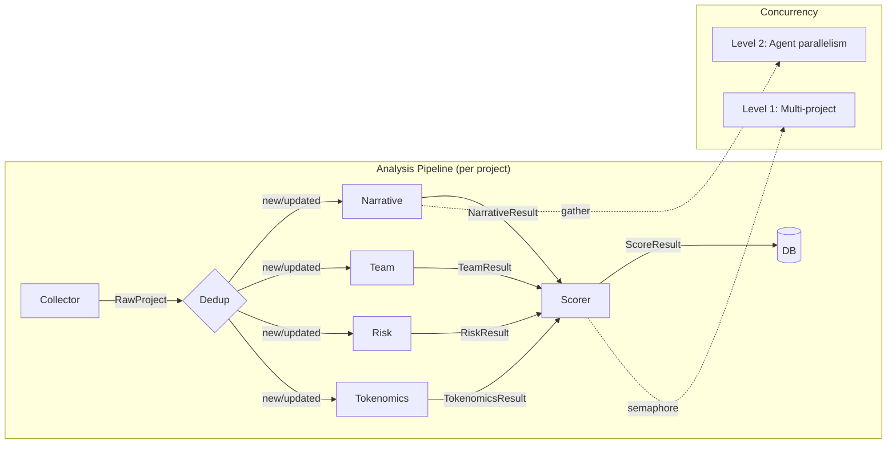
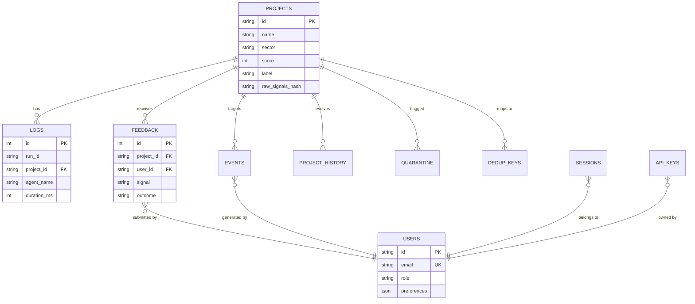
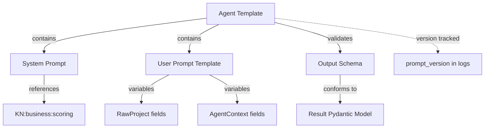
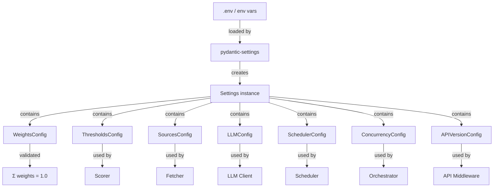

# ──────────────────────────────────────────────
# Knowledge Base
# ──────────────────────────────────────────────
# 本目录管理项目结构化的知识资产，包括业务知识、技术知识、
# Prompt 知识、模型知识、API 知识、外部依赖等。
#
# 目录结构（v1.1 — 已有实际文件的知识）：
#   knowledge/
#   ├── README.md               # 本文档（含知识图谱）
#   ├── faq.md                  # ✅ 常见问题
#   ├── glossary/               # ✅ 术语表引用入口
#   │   └── README.md           # 术语表（引用 docs/GLOSSARY.md）
#   ├── business/               # ✅ 业务知识
#   │   └── scoring-logic.md    # 评分业务知识
#   ├── technical/              # ✅ 技术知识
#   │   ├── agent-pipeline.md   # Agent 流水线技术知识
#   │   └── concurrency.md      # 并发控制知识
#   ├── api/                    # ✅ API 知识
#   │   └── data-sources.md     # 外部数据源接口知识
#   ├── external/               # ✅ 外部依赖文档
#   │   └── dependencies.md     # 核心依赖与锁定策略
#   └── decisions/              # ✅ 决策树
#       └── ADR-007-concurrency.md  # 并发模型决策树
#
# 注：✅ 表示该目录/文件已存在
# ──────────────────────────────────────────────

---

## 1. 知识库结构

| 目录 | 内容 | 来源 |
| --- | --- | --- |
| `glossary/` | 业务 + 技术术语统一 | `docs/GLOSSARY.md` |
| `faq.md` | 常见问题与解答 | 开发/运维经验积累 |
| `business/` | 空投/Web3 领域知识、评分逻辑 | `docs/DATA_SCORING_DICT.md` |
| `technical/` | 技术栈细节、架构说明 | `docs/ENGINEERING_ROADMAP.md` |
| `api/` | 外部 API 文档摘要 | 各 API 官方文档 |
| `external/` | 外部依赖版本/接口说明 | `requirements.txt` |
| `decisions/` | 架构决策树 | `docs/adr/` |

---

## 2. 引用规范

在 Prompt/Agent/代码中引用知识：

| 引用格式 | 示例 |
| --- | --- |
| `[KN:glossary:FARM]` | 引用 Glossary 中 FARM 的定义 |
| `[KN:business:scoring]` | 引用评分业务知识 |
| `[KN:technical:concurrency]` | 引用并发模型技术知识 |
| `[KN:api:defillama]` | 引用 DefiLlama API 文档 |
| `[KN:external:sqlite]` | 引用 SQLite 依赖说明 |
| `[KN:decision:ADR-007]` | 引用并发模型决策 |

---

## 3. 知识图谱

### 3.1 系统模块关系图

### 3.2 Agent 关系图

### 3.3 数据库关系图 (ER)

### 3.4 Prompt 关系图

### 3.5 配置关系图

---

## 4. 知识更新流程

1. **新增知识**：在对应子目录创建 `.md` 文件
2. **引用链接**：使用 `[KN:category:key]` 格式引用
3. **交叉验证**：更新知识时检查所有引用处是否需要同步更新
4. **废弃标记**：知识过时后在文件头部添加 `_⚠️ 此知识已过时，参见 [新知识链接]_`

---

## 5. FAQ

| 问题 | 回答 |
| --- | --- |
| 如何判断一个项目是否值得 FARM？ | 见 `docs/DATA_SCORING_DICT.md` §4 评分算法 |
| 系统如何处理缺失数据？ | 见 `docs/ENGINEERING_ROADMAP.md` §7.6 缺失降级策略 |
| 如何添加新数据源？ | 见 `docs/ENGINEERING_ROADMAP.md` §10，实现 fetcher + 容错矩阵 |
| LLM 集成如何工作？ | 见 `docs/ENGINEERING_ROADMAP.md` §19 |
| 如何贡献代码？ | 见 `CONVENTIONS.md` §11 Git 规范 |
| 遇到 Bug 怎么办？ | 使用 `.github/ISSUE_TEMPLATE/bug_report.md` 提交 Issue |
| 如何部署到生产？ | 见 `docs/DEPLOYMENT.md` |

---

_文档版本：v1.0 · 2026-07-08_
